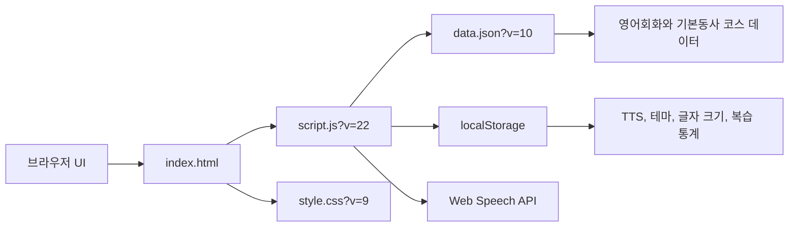

# 영어 회화 암기 사이트 하드닝 보고서

작성일. 2026-06-16

브랜치. `codex/project-hardening-docs`

## 요약

이번 하드닝 작업은 정적 GitHub Pages 구조를 유지한 상태에서 실제 위험이 확인된 부분만 좁게 수정했습니다. 핵심 코드 변경은 `data.json` 로딩 실패 화면에서 동적 `innerHTML` 템플릿을 제거하고, DOM 노드와 `textContent`로 오류 메시지를 렌더링하도록 바꾼 것입니다.

`data.json`은 변경하지 않았으므로 `DATA_VERSION`은 `10`으로 유지했습니다. `script.js`만 변경되었기 때문에 `index.html`의 스크립트 캐시 키는 `script.js?v=21`에서 `script.js?v=22`로 올렸습니다.

## 프로젝트 목적

이 사이트는 영어 회화와 기본동사 학습 문장을 반복 암기하기 위한 개인용 정적 웹 애플리케이션입니다. 사용자는 코스를 선택하고, Day를 고르고, 답변을 표시하고, 한국어 질문과 영어 답변을 다시 들을 수 있습니다. 글자 크기, 다크 모드, TTS 음성, 복습 기록은 브라우저 `localStorage`에 저장됩니다.

## 런타임 아키텍처

읽기용 대체 흐름 표입니다.

| 출발 | 도착 | 역할 |
|---|---|---|
| 브라우저 UI | `index.html` | 정적 페이지 구조와 학습 컨트롤을 제공합니다. |
| `index.html` | `script.js?v=22` | 캐시 키가 붙은 런타임 로직을 불러옵니다. |
| `index.html` | `style.css?v=9` | 화면 레이아웃과 모달, 카드, 다크 모드를 적용합니다. |
| `script.js` | `data.json?v=10` | 공개 학습 데이터를 가져옵니다. |
| `script.js` | `localStorage` | 사용자별 설정과 복습 기록을 저장합니다. |
| `script.js` | Web Speech API | 브라우저 내장 음성 합성을 사용합니다. |

## 모듈 지도

| 파일 | 역할 |
|---|---|
| `index.html` | 정적 문서 구조, 코스 선택, Day 선택, 모달, 카드 영역, 캐시 키가 붙은 자원 참조를 담당합니다. |
| `style.css` | 반응형 레이아웃, 다크 모드, 카드, 버튼, 설정 모달, 통계 모달 스타일을 담당합니다. |
| `script.js` | 데이터 로딩, 코스와 Day 정규화, 카드 렌더링, 이동 버튼, TTS, 설정 저장, 복습 통계, Refresh 캐시 무효화를 담당합니다. |
| `data.json` | 영어회화와 기본동사 코스의 공개 학습 문장을 보관합니다. |
| `tests/*.test.js` | Node VM 기반으로 데이터 정규화, 렌더링, TTS, 저장소 내구성, 기본동사 데이터 무결성을 검증합니다. |

## 핵심 사용자 흐름

1. 페이지 로드 시 `fetch(buildDataUrl())`가 `data.json?v=10`을 요청합니다.
2. 페이지 URL에 `refresh` 값이 있으면 같은 값이 `data.json` 요청에도 붙습니다.
3. Refresh 버튼은 문서 URL과 데이터 요청 URL을 모두 새로 만들어 GitHub Pages의 JSON 캐시를 우회합니다.
4. `QuizApp`은 코스별 데이터를 한 번 정규화한 뒤 Day 카드 목록을 렌더링합니다.
5. 질문과 답변 텍스트는 `textContent`로 렌더링됩니다.
6. TTS는 Web Speech API를 사용하고, 음성 선택과 속도 설정은 `localStorage`에 저장됩니다.
7. 복습 통계는 `reviewStats:<courseId>` 키로 코스별 분리 저장됩니다.
8. `data.json` 로딩이 실패하면 `renderLoadFailure()`가 한글 오류 화면을 DOM 노드로 구성합니다.

## 하드닝 변경 사항

| 상태 | 영역 | 확인 근거 | 처리 결과 |
|---|---|---|---|
| 수정 완료 | 시작 시 데이터 로딩 실패 화면 | 이전 코드가 실패 메시지를 `${error.message}`로 `innerHTML`에 삽입했습니다. | `renderLoadFailure()`를 추가해 오류 메시지를 `textContent`로 표시하도록 변경했습니다. |
| 안전 확인 | 남은 `innerHTML` 사용 | 현재 런타임 코드의 남은 사용은 `replaceElementChildren()`의 `element.innerHTML = ''` fallback입니다. | 외부 데이터 삽입이 아니라 자식 노드 초기화 용도입니다. 최신 브라우저에서는 `replaceChildren()`가 우선 사용됩니다. |
| 안전 확인 | 통계 표 렌더링 | `renderStats()`가 `td`를 만들고 `textContent`로 값을 채웁니다. | 깨진 `localStorage` 통계는 테스트로 정규화 동작을 확인했습니다. |
| 안전 확인 | Refresh 캐시 무효화 | `buildDataUrl()`가 `refresh` 값을 `encodeURIComponent()`로 인코딩합니다. | 기존 캐시 우회 동작을 유지했습니다. |

## 보안 검토

검토 모드. 일상 점검 모드.

| 표면 | 결과 |
|---|---|
| 공개 엔드포인트 | GitHub Pages가 제공하는 정적 파일만 있습니다. |
| 인증과 세션 | 서버 인증, 계정, 권한 상승 흐름이 없습니다. |
| 비밀값 | 구체적인 키 형식 검색에서 비밀값 후보가 발견되지 않았습니다. `.env`는 `.gitignore`에 포함되어 있고, `.env` 추적 이력도 발견되지 않았습니다. |
| 의존성 | `package.json`과 lockfile이 없어 런타임 npm 공급망 표면이 없습니다. |
| CI/CD | 현재 트리에 `.github` 워크플로우 디렉터리가 없습니다. |
| 데이터 | `data.json`은 공개 학습 콘텐츠입니다. 비공개 원문이나 민감한 학습 메모를 넣으면 안 됩니다. |

확인된 보안 항목입니다.

| 심각도 | 신뢰도 | 상태 | 내용 |
|---|---:|---|---|
| 중간 | 9/10 | 수정 완료 | 데이터 로딩 실패 화면에서 동적 `innerHTML`을 사용하던 경로를 제거했습니다. |

이번 일상 점검에서 남아 있는 고신뢰 보안 취약점은 발견하지 못했습니다. 이 결과는 전문 보안 감사의 대체물이 아닙니다.

## 성능 메모

최근 성능 개선은 유지되었습니다. 코스 데이터 정규화는 코스별로 캐시되고, 통계 표는 DOM API와 `textContent`로 렌더링되며, TTS 음성 조회는 반복 검색을 줄입니다. 카드 전환은 강제 동기 레이아웃 읽기에 의존하지 않습니다. 이번 문서 보정 작업은 런타임 성능 경로를 변경하지 않습니다.

## 실행과 테스트 명령

| 목적 | 명령 |
|---|---|
| 정적 사이트 실행 | `python -m http.server 8022 --bind 127.0.0.1` |
| 전체 테스트 | `node --test` |
| 문법 검사 | `node --check script.js` |
| 공백 오류 검사 | `git diff --check` |
| 브라우저 검증 URL | `http://127.0.0.1:8022/` |

## 검증 증거

| 검사 | 결과 |
|---|---|
| 기준 테스트 | 코드 변경 전 `node --test`가 27개 테스트를 통과했습니다. |
| 실패 테스트 | `renderLoadFailure is not a function` 오류로 새 테스트가 먼저 실패했습니다. |
| 집중 테스트 | 구현 후 `node --test tests\quiz-data-normalization.test.js`가 6개 테스트를 통과했습니다. |
| 전체 테스트 | 구현 후 `node --test`가 28개 테스트를 통과했습니다. |
| 문법 검사 | `node --check script.js`가 종료 코드 0으로 끝났습니다. |
| 공백 검사 | `git diff --check`가 종료 코드 0으로 끝났습니다. |
| 브라우저 정상 흐름 | Edge에서 `script.js?v=22` 로드, 기본동사 전환, 35개 Day 옵션, 답변 표시를 확인했습니다. |
| 브라우저 실패 흐름 | 강제 `data.json` 500 응답에서 `데이터 로딩 실패`가 정상 표시되고 이미지와 스크립트 태그가 생성되지 않음을 확인했습니다. |

## 남은 위험

| 위험 | 상태 | 다음 조치 |
|---|---|---|
| Notion 원문과 `data.json` 수동 동기화가 어긋날 수 있습니다. | 수용된 위험입니다. | 콘텐츠 동기화 후 데이터 테스트와 라이브 Pages 확인을 계속 수행합니다. |
| 비밀값 스캐너 설정 파일이 커밋되어 있지 않습니다. | 현재 정적 개인 사이트 범위에서는 수용된 위험입니다. | 자동화나 비밀값 취급이 돌아오면 `.gitleaks.toml` 같은 설정을 추가합니다. |
| CSP 메타 정책이 없습니다. | 현재 구조에서는 수용된 위험입니다. | 외부 입력 또는 비신뢰 콘텐츠를 다루기 시작하면 CSP를 추가하고 브라우저 회귀 검증을 수행합니다. |
| `data.json`은 공개 배포됩니다. | 설계상 수용된 위험입니다. | 비공개 원문, 개인 메모, 인증 정보는 배포 데이터에 넣지 않습니다. |
