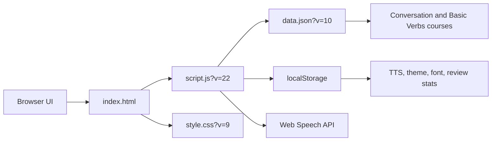

# English Conversation Memorization Site Hardening Report

Date: 2026-06-16

Branch: `codex/project-hardening-docs`

## Executive Summary

This pass kept the project architecture intentionally small: static HTML, CSS, JavaScript, and `data.json` served by GitHub Pages. The only code hardening change replaces the startup data-load failure `innerHTML` template with DOM nodes and `textContent`, then bumps the script query key from `script.js?v=21` to `script.js?v=22`.

Verification passed locally with Node tests, JavaScript syntax check, whitespace diff check, and a real Microsoft Edge browser flow against `http://127.0.0.1:8022/`.

## Project Purpose

The site is a personal memorization helper for English conversation and basic verb practice. It lets the learner choose a course, select a day, reveal answers, replay Korean or English TTS, switch ordering modes, and store review progress in browser `localStorage`.

## Runtime Architecture

Fallback flow table.

| From | To | Purpose |
|---|---|---|
| Browser UI | `index.html` | Static page shell and controls. |
| `index.html` | `script.js?v=22` | Cache-busted runtime logic. |
| `script.js` | `data.json?v=10` | Public course and card data. |
| `script.js` | `localStorage` | User-only preferences and review history. |
| `script.js` | Web Speech API | Browser-native TTS playback. |

## Module Map

| File | Role |
|---|---|
| `index.html` | Static document structure, controls, modals, and cache-busted script/style references. |
| `style.css` | Responsive layout, dark mode, modal, card, controls, and stats table styling. |
| `script.js` | Data loading, course/day normalization, rendering, navigation, TTS, theme/font settings, review stats, and refresh cache busting. |
| `data.json` | Public course data for conversation and basic verbs lessons. |
| `tests/*.test.js` | Node VM tests for normalization, rendering, TTS behavior, storage resilience, and course data integrity. |

## Key Flows

1. Page load calls `fetch(buildDataUrl())`, where `DATA_VERSION` remains `10`.
2. A `refresh` query parameter on the page is copied into the `data.json` URL so the Refresh button busts the GitHub Pages JSON cache.
3. `QuizApp` normalizes course data once per course and renders card text with `textContent`.
4. TTS calls stay in browser APIs and store voice/rate settings locally.
5. Review stats are namespaced by course in `localStorage` as `reviewStats:<courseId>`.
6. If `data.json` fails to load, `renderLoadFailure()` now creates DOM nodes and writes the error detail via `textContent`.

## Hardening Change

Confirmed issue fixed.

| Status | Area | Evidence | Resolution |
|---|---|---|---|
| Fixed | Startup error rendering | `HEAD` used `container.innerHTML` with `${error.message}` in the load failure path. | Added `renderLoadFailure()` and regression coverage so error details are written as text nodes. |
| Verified safe | Remaining `innerHTML` use | Current source has only `element.innerHTML = ''` in the `replaceElementChildren()` fallback. | It clears children and does not interpolate external data. Modern browsers use `replaceChildren()`. |
| Verified safe | Stats table rendering | `renderStats()` creates cells and assigns `textContent`. | Malformed `localStorage` stats are normalized by tests. |
| Verified safe | Refresh token handling | `buildDataUrl()` encodes the page `refresh` parameter before appending it to `data.json`. | Existing cache-busting behavior preserved. |

## Security Review

Mode: daily, zero-noise review.

Attack surface.

| Surface | Result |
|---|---|
| Public endpoints | Static GitHub Pages files only. |
| Auth/session | None. No server-side account or privileged flow. |
| Secrets | No concrete key-format matches in source scan. `.env` is ignored, and no `.env` history was found. |
| Dependencies | No `package.json` or lockfile; runtime has no npm dependency supply-chain surface. |
| CI/CD | No `.github` workflow directory in the current tree. |
| Data | `data.json` is public learning content and should not contain private source-only material. |

Findings.

| Severity | Confidence | Status | Finding |
|---|---:|---|---|
| Medium | 9/10 | Fixed | Startup failure path used dynamic `innerHTML`; fixed in this pass. |

No remaining high-confidence vulnerabilities were found in the daily review. This is not a substitute for a professional security audit.

## Performance Notes

Recent performance improvements are preserved: course data normalization is cached per course, stats rendering uses DOM nodes, TTS voice lookup is cached, and card transitions no longer rely on forced synchronous layout reads. This pass does not change the normal render hot path except for the cold error state.

## Build, Run, and Test Commands

| Purpose | Command |
|---|---|
| Run static site | `python -m http.server 8022 --bind 127.0.0.1` |
| Full tests | `node --test` |
| Syntax check | `node --check script.js` |
| Whitespace check | `git diff --check` |
| Browser QA URL | `http://127.0.0.1:8022/` |

## Verification Evidence

| Check | Result |
|---|---|
| Baseline tests | `node --test` passed 27/27 before code changes. |
| Red test | Focused test failed with `renderLoadFailure is not a function`. |
| Focused test after fix | `node --test tests\quiz-data-normalization.test.js` passed 6/6. |
| Full tests after fix | `node --test` passed 28/28. |
| Syntax | `node --check script.js` exited 0. |
| Whitespace | `git diff --check` exited 0. |
| Browser normal flow | Edge loaded `script.js?v=22`, switched to basic verbs, showed 35 day options, and revealed the answer. |
| Browser failure flow | Forced `data.json` 500 rendered `데이터 로딩 실패`; injected-looking input created 0 image/script tags. |

## Remaining Risks

| Risk | Status | Next Action |
|---|---|---|
| Manual Notion-to-`data.json` sync can drift. | Accepted risk. | Continue using data tests and live Pages checks after content syncs. |
| No committed secret-scanner config. | Accepted risk for this static personal site. | Add `.gitleaks.toml` or equivalent if secrets or automation return. |
| No CSP meta policy. | Accepted risk. | Consider adding and browser-testing a CSP only if the app starts handling untrusted content. |
| `data.json` is public. | Accepted by design. | Do not place private or source-only study notes in deployed data. |
